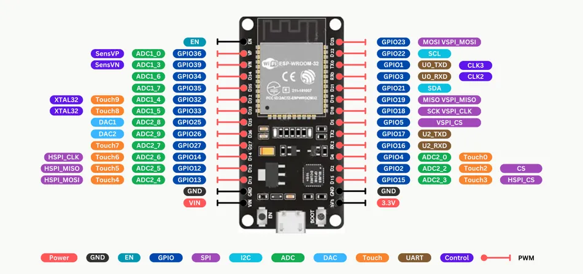
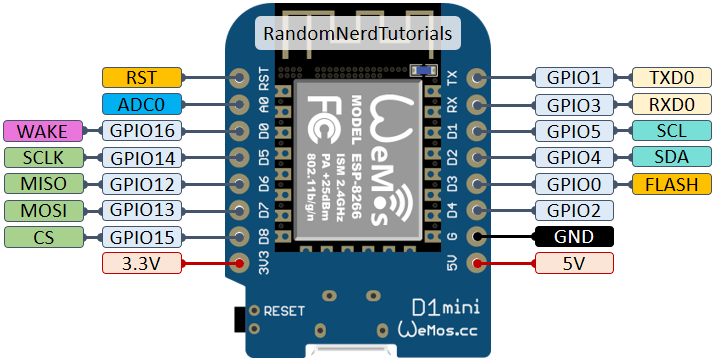
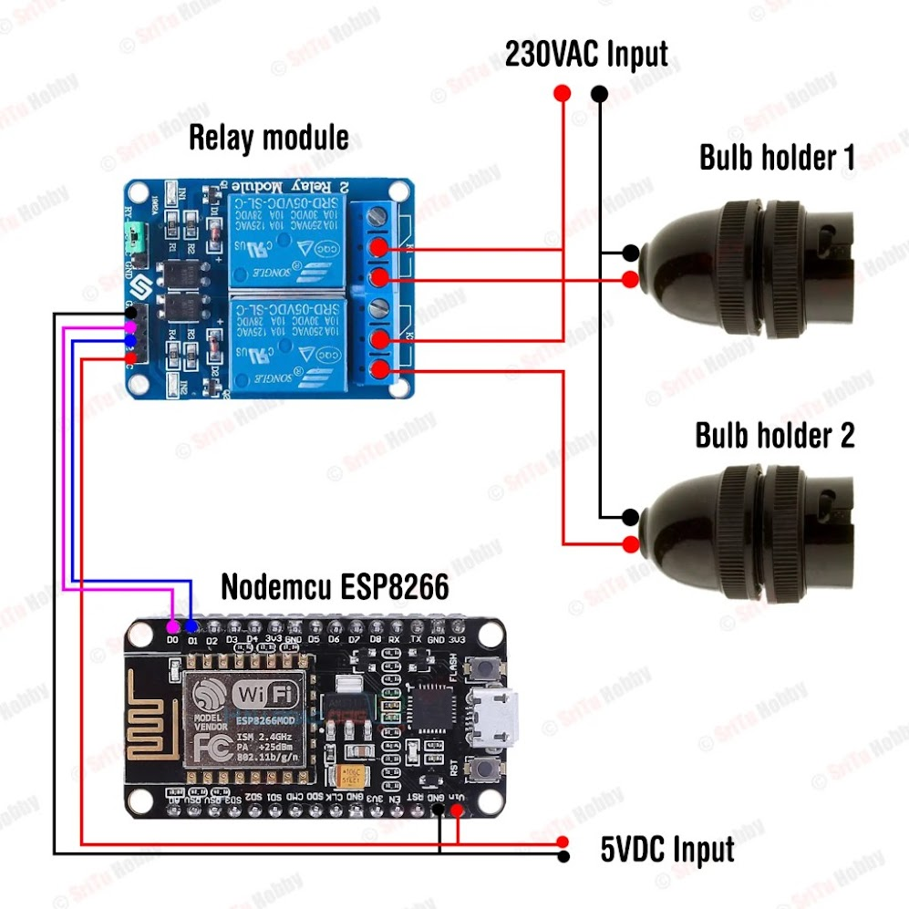

# 🌐 Smart Node – Scalable Smart Home Automation System

> A low-cost, modular, and scalable smart home management system using **ESP32-S3** and **ESP8266 (NodeMCU)** to promote accessible automation for daily life.


### 📷 ESP32-S3 Pinout Diagram


### 📷 ESP8266 Pinout Diagram




---

## 📘 Project Overview

**Smart Node** is a smart home automation project designed to improve accessibility, reduce energy waste, and enable affordable connected living. It allows users to control appliances like lights, fans, and sensors via mobile devices or web dashboards using Wi-Fi-enabled microcontrollers.

Built on insights from the IEEE paper _“Scalable Smart Home Management with ESP32‑S3: A Low‑Cost Solution for Accessible Home Automation”_, this project simplifies complex systems into practical home solutions.

---

## 🧠 Key Features

- 📶 Remote switching via Wi-Fi using the Blynk App
- 💻 Web interface and mobile access
- ♻️ Real-time device status
- 🛡️ Sensor integration (DHT11, PIR, etc.)
- 🔒 Secure communication (optional MQTT/Firebase)
- 🛠️ Modular setup (easy to scale room-by-room)

---

## 🧰 Hardware Components

| Component       | Description                        |
|----------------|------------------------------------|
| ESP8266 NodeMCU| Wi-Fi Microcontroller (Low-cost)   |
| ESP32-S3       | Advanced MCU for main control node |
| Relay Module   | Switch appliances                  |
| Power Adapter  | 5V regulated supply for the board  |


---

## 👂 Folder Structure

```
SmartNode/
├── esp32_s3/
│   └── esp32.ino
├── esp8266/
│   └── SN26.ino
├── circuit_diagrams/
├── README.md
```

---

## 🚀 Getting Started

### 1. Prerequisites
- Arduino IDE or PlatformIO
- ESP32 & ESP8266 board packages installed
- Libraries: `WiFi`, `AsyncWebServer`, `BlynkSimpleEsp8266`

### 2. Flashing Instructions
- Open `blynk_relay_controller.ino` inside `esp8266/`
- Replace your **Wi-Fi credentials** and **Blynk Auth Token**
- Upload the sketch using Arduino IDE
- Open the **Blynk App** (from Play Store) and connect to **V0** and **V1** pins to control the relays

---

## 🔗 Important References

- 🔧 [ESP32-S3 – Espressif Official](https://www.espressif.com/en/products/socs/esp32-s3)
- 📄 [ESP8266 Datasheet](https://www.espressif.com/en/products/socs/esp8266)
- 📱 [Blynk App – Play Store](https://play.google.com/store/apps/details?id=cloud.blynk)
- 🛠️ [ESP-IDF SDK](https://github.com/espressif/esp-idf)

---

## 📓 IEEE Base Paper

**Title:** Scalable Smart Home Management with ESP32‑S3: A Low‑Cost Solution for Accessible Home Automation  
**Published:** 2024, International Conference on Computer and Applications  
**DOI:** [10.1109/ICCA62237.2024.10927887](https://ieeexplore.ieee.org/document/10927887)

---

## ♻️ SDG Mapping

**Goal:** SDG 7 – Affordable and Clean Energy  
**Target 7.3:** Improve energy efficiency by enabling intelligent appliance control through automation.

---

## 📜 License

This project is open-source under the MIT License.

---

## 👨‍💼 Authors & Acknowledgment

Made by Divya Darshan, Harish  
Based on the IEEE paper mentioned above and developed under the course *23CS1512 – Socially Relevant Mini Project* at **Panimalar Engineering College**.

---
